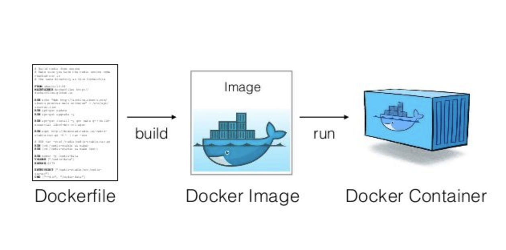

# Learning the cutiest whale  🐳




## Hello-World/ 

Build image name `hello-world`
```
docker build -t hello-world . 
```

Run container with `hello-world` image
```
docker run hello-world
```
---

## PieDock/

Build image name `pie-dock`
```
docker build -t pie-dock .
```

Run container with `pie-dock` image
```
docker run -d --name python-app -p 5000:5000 pie-dock
```


